# Drawing up plays with ggulti

## Getting Started

Install ggulti from github with:

``` r
install.packages("devtools")
devtools::install_github("swebb1/ggulti")
```

Load the ggulti package:

``` r
library(ggulti)
```

## Create a pitch

Use the
[`ggpitch()`](https://swebb1.github.io/ggulti/reference/ggpitch.md)
function to create a pitch. The `type` argument specifies the type of
pitch to create. The `endzone_fill` argument specifies the color of the
endzone.

``` r
pitch = ggpitch(type="half_attack",endzone_fill = "#AA4422", ymin = 50)
```

Pitch types

- “full” = Full pitch (default)

- “half_attack” = Half a pitch showing attacking endzone (up)

- “half_defend” = Half a pitch showing defending endzone (down)

- “blank” = Lined out area. Useful for drills etc.

- “void” = No pitch background.

``` r
ggpitch()
```

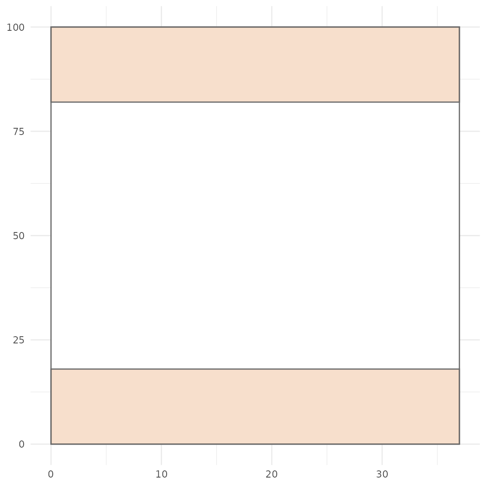

``` r
ggpitch(type = "half_attack", fill = "lightgreen", alpha=1, ymin = 50)
```

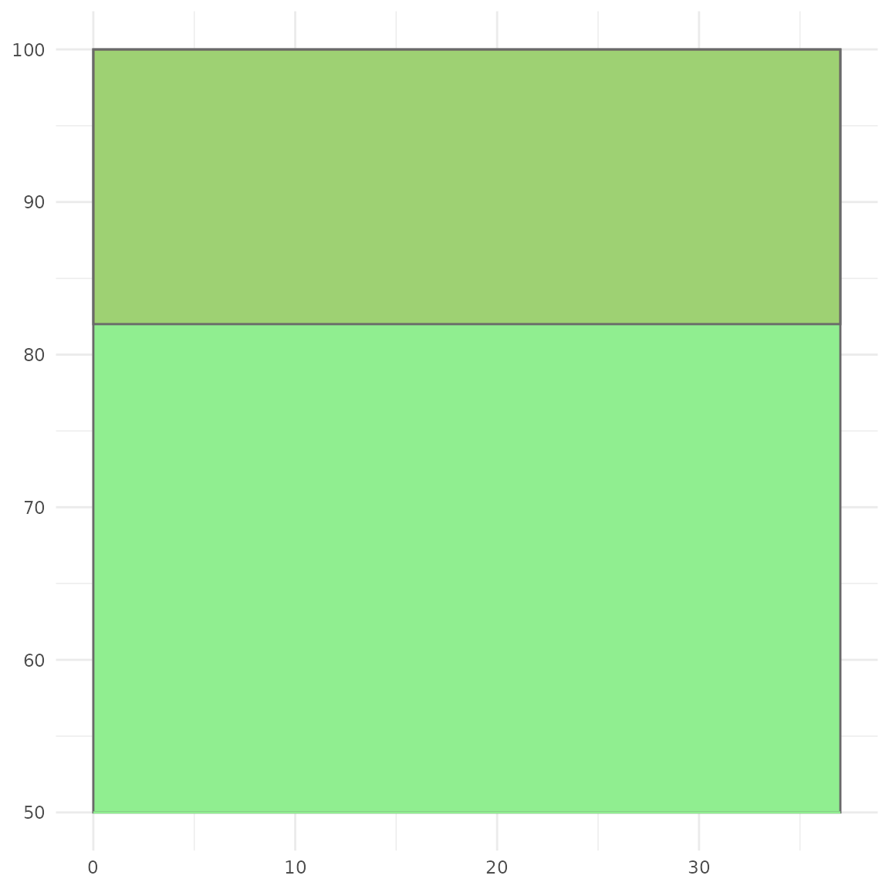

``` r
ggpitch(type = "half_defend", endzone_fill = "black", ymax = 50)
```

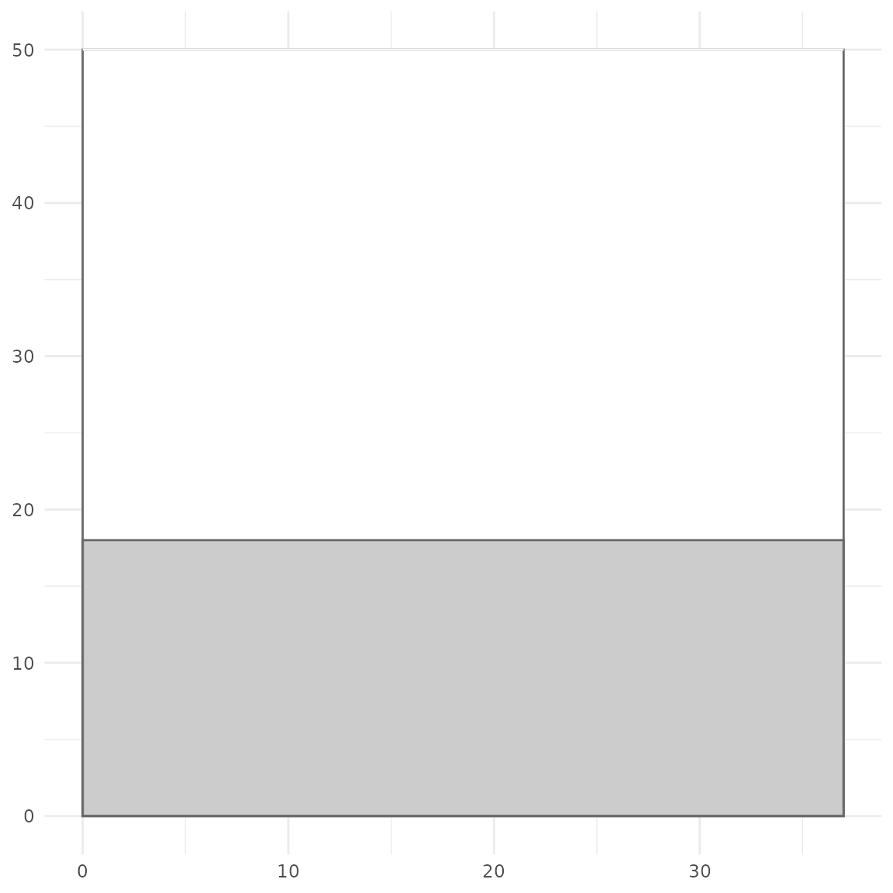

``` r
ggpitch(type = "blank", ymax = 50, xmax = 30)
```

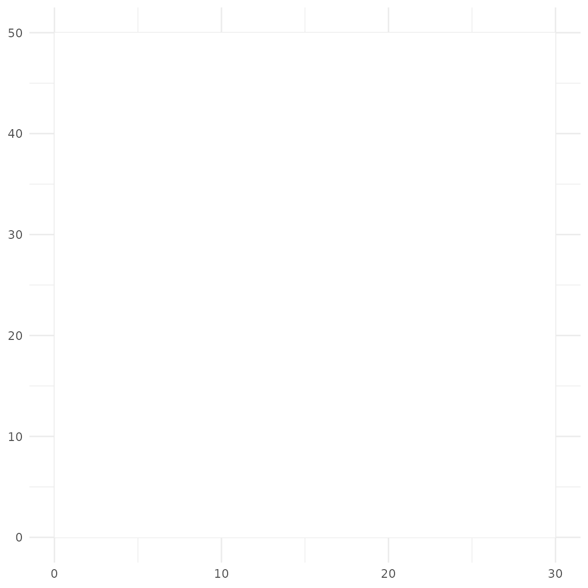

``` r
ggpitch(type = "void")
```


The [`ggpitch()`](https://swebb1.github.io/ggulti/reference/ggpitch.md)
function returns a *ggplot* object that can be customised further.

## Pitch objects

Pitch objects are plotted as points and are typically players, discs and
cones. Use the
[`pitch_object()`](https://swebb1.github.io/ggulti/reference/pitch_object.md)
function to create object and their positions.

Let’s create a list of three offense players attacking the endzone with
the
[`pitch_object()`](https://swebb1.github.io/ggulti/reference/pitch_object.md)
function:

``` r
players <- list(
  pitch_object(label = "H1", show = T, x = c(5), y = c(75), alpha = 0.8, frame = 1:3),
  pitch_object(label = "H2", show = T, x = c(20), y = c(75), alpha = 0.5, frame = 1:3),
  pitch_object(label = "C1", show = T, x = c(18,14,5), y = c(83,83,98), alpha = 0.8, frame = 1:3)
)
```

In the code above, we have two stationary handlers (H1 and H2) and one
cutter (C1) making a cut along the front of the endzone and to the back
corner.

### What are frames?

Frames are used to animate objects. In the code above, the `frame`
argument specifies the frames that the object is visible. In this case,
the objects are visible in frames 1, 2 and 3. H1 and H2 are stationary
objects so only have single x and y coordinates. C1 is a moving object
so has multiple x and y coordinates for each frame. The frame argument
is optional and defaults to 1 (e.g. a single image).

We can plot out our players on the pitch we created using the
[`plot_play()`](https://swebb1.github.io/ggulti/reference/plot_play.md)
function. The default is to plot frame 1.

``` r
plot_play(pitch = pitch, object_list = players)
```

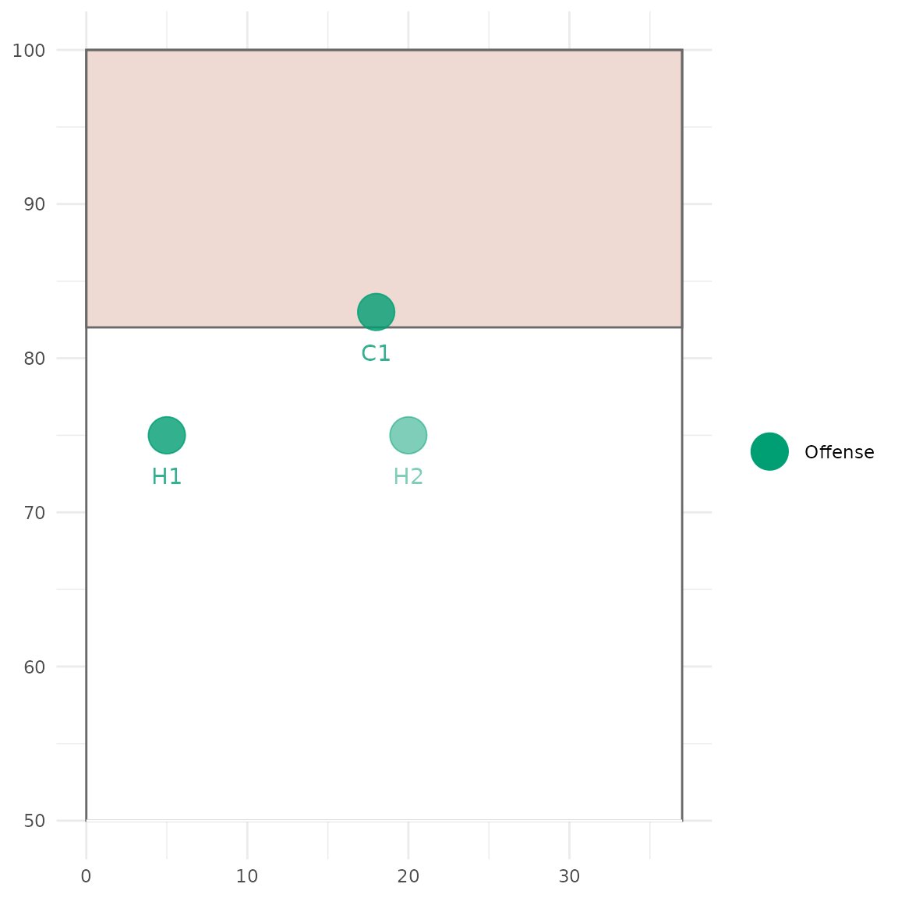

We can also choose which frame to plot:

``` r
plot_play(pitch = pitch, object_list = players, static_frame = 3)
```

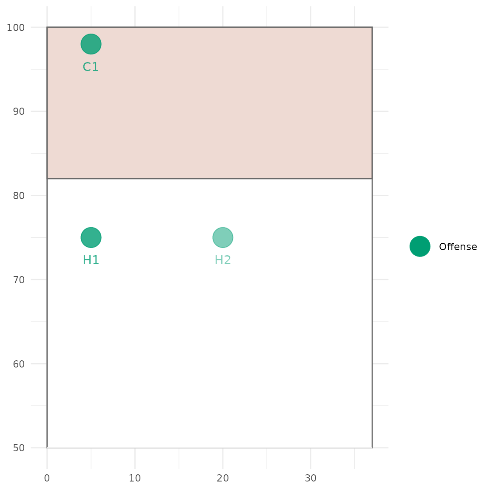

Or we can plot all frames and objects which might be useful when
creating our plots:

``` r
plot_play(pitch = pitch, object_list = players,show_all = T)
```

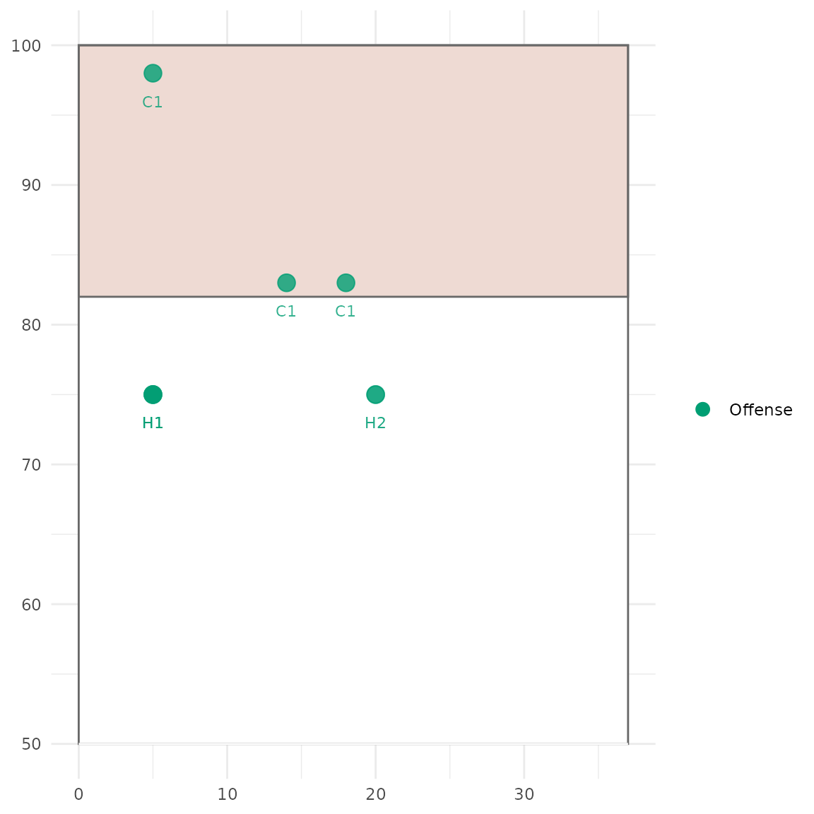

### Other object types

By default, the object type is set to “Offense”. The following object
types are recognised

- “Offense” = Green circle

- “Defense” = Blue circle

- “Coach” = Red circle

- “Cone” = Orange triangle

- “Disc” = Small grey circle

``` r
random <- list(
  pitch_object(label = "Queue-here", show = T, object = "Cone", x = c(5), y = c(75), alpha = 0.8, frame = 1),
  pitch_object(label = "Pep", show = T, object = "Coach", x = c(20), y = c(75), alpha = 0.5, frame = 1),
  pitch_object(label = "disc", show = F, object = "Disc", x = c(18), y = c(83), alpha = 0.8, frame = 1),
  pitch_object(label = "D1", show = F, object = "Defense", x = c(18), y = c(55), alpha = 0.8, frame = 1)
)

plot_play(pitch = pitch, object_list = random)
```

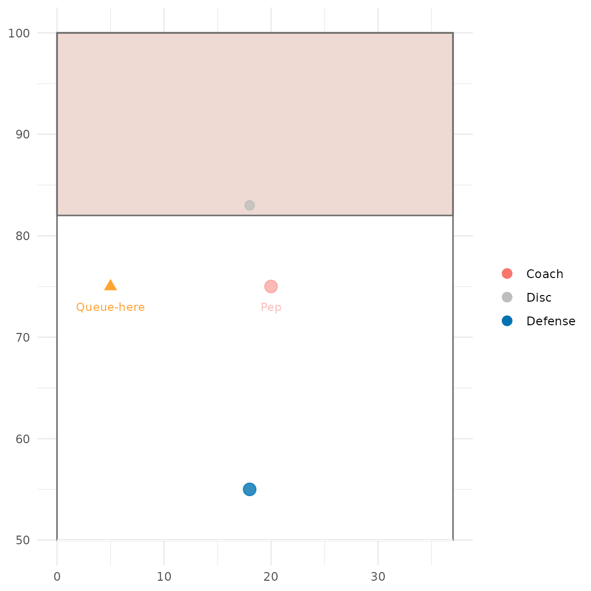

### Custom objects

You can also add your own custom objects by specifying a different
`object` argument.

``` r
custom <- list(
  pitch_object(label = "Ref", show = T, object = "Referee", x = c(18), y = c(55), alpha = 0.8, frame = 1)
)

plot_play(pitch = pitch, object_list = custom)
```

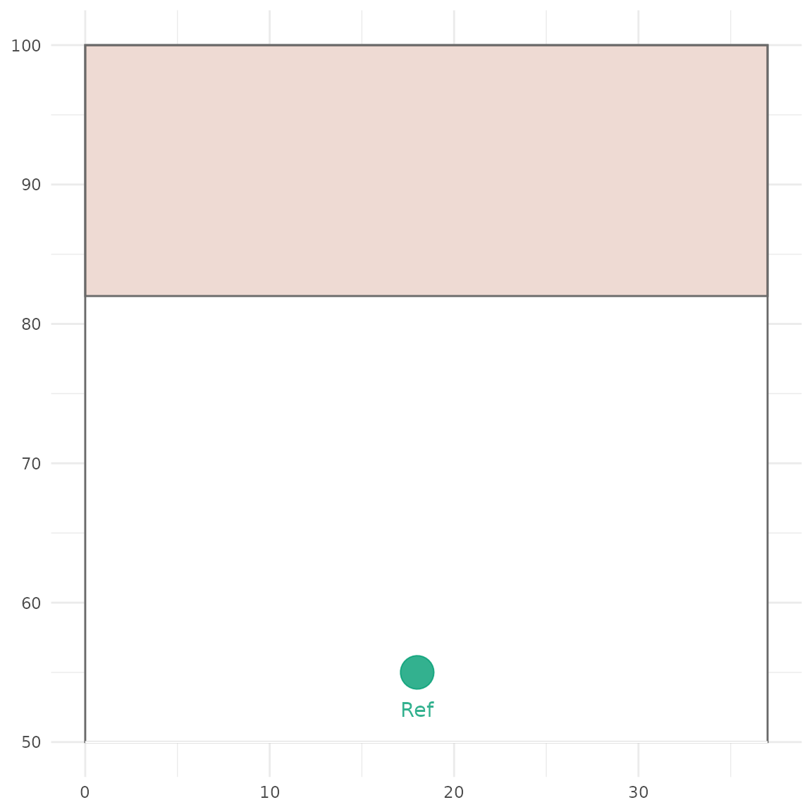

By default the object will present as an offense object. You can change
the default options (colour, size, shape) in the
[`plot_play()`](https://swebb1.github.io/ggulti/reference/plot_play.md)
function:

``` r
plot_play(pitch = pitch, object_list = custom, default_obj_col = "black")
```

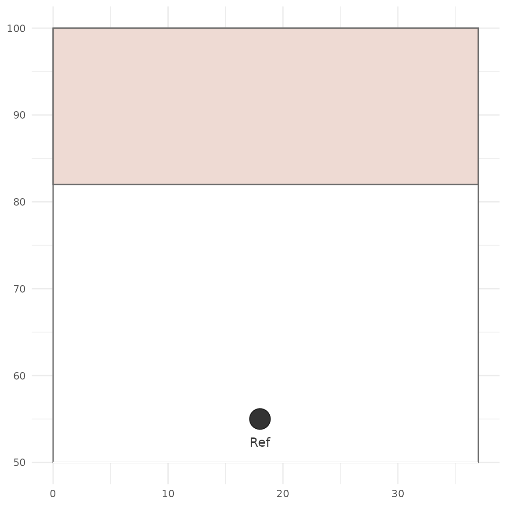

Alternatively, you can use the `pv` argument to add a new list of
plotting values. The `ggulti_plot_values` object gives access to default
values:

``` r
pv <- ggulti_plot_values
pv$obj_cols <- c(pv$obj_cols,"Referee" = "black")
pv$obj_shapes <- c(pv$obj_shapes,"Referee" = 18)
pv$obj_sizes <- c(pv$obj_sizes,"Referee" = 2)

plot_play(pitch = pitch, object_list = custom, pv = pv)
```

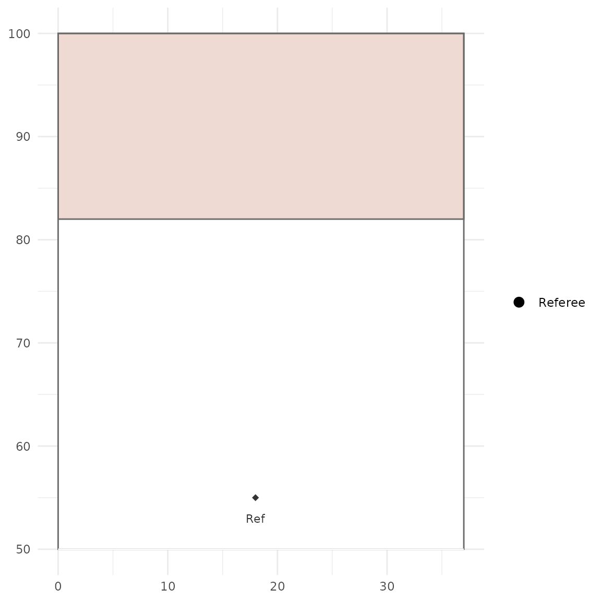

By customising objects, you can specifiy specific teams, genders or even
psoitions e.g.

``` r
zone_positions <- c("Cup" = "blue", "Wing" = "red", "Mid" = "purple", "Deep" = "green")
pv <- ggulti_plot_values
pv$obj_cols <- c(ggulti_plot_values$obj_cols, zone_positions)

zone <- list(
  pitch_object(label = "C1", show=T, object = "Cup", x=c(14), y=c(25)),
  pitch_object(label = "C2", show=T, object = "Cup", x=c(18), y=c(28)),
  pitch_object(label = "C3", show=T, object = "Cup", x=c(22), y=c(25)),
  pitch_object(label = "W1", show=T, object = "Wing", x=c(10), y=c(40)),
  pitch_object(label = "W2", show=T, object = "Wing", x=c(27), y=c(40)),
  pitch_object(label = "Mid", show=T, object = "Mid", x=c(18), y=c(38), label_pos = "up"),
  pitch_object(label = "Deep", show=T, object = "Deep", x=c(18), y=c(60))
)

plot_play(pitch = ggpitch(endzone_fill="darkgrey"),object_list = zone,pv=pv)
```

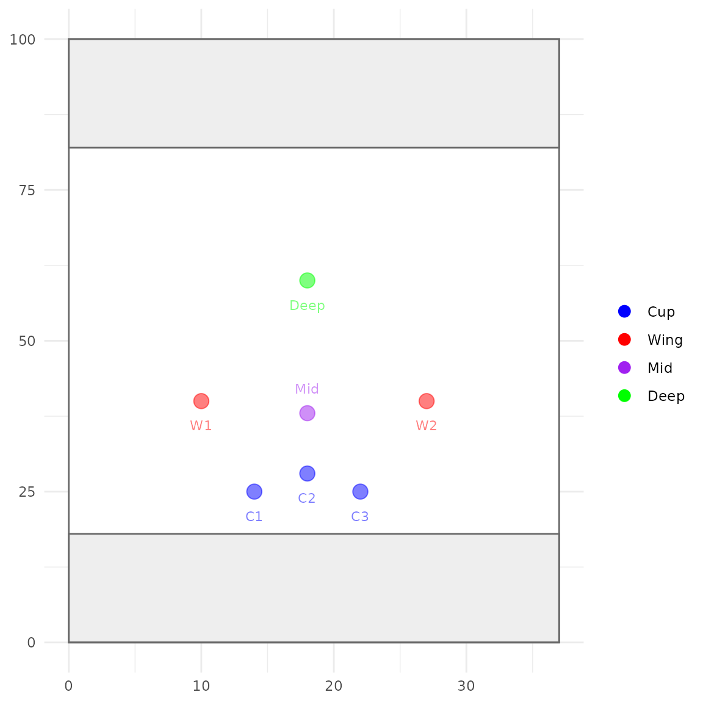

## Add defenders

Let’s return to our original set of three offense players attacking the
endzone. We would like to add a defender to each player.

We can add defenders using the
[`pitch_object()`](https://swebb1.github.io/ggulti/reference/pitch_object.md)
function and specifying the object type as “Defense”. We can also use
the
[`defender()`](https://swebb1.github.io/ggulti/reference/defender.md)
function to add defenders to existing players. Defenders are objects
that follow another object through frames. You can set their position
relative to the object using the `xjust` and `yjust` arguments.

Defenders inherit defaults from their player (frame,alpha, show). The
default for `xjust` and `yjust` is -1. This means the defender will be
placed 1 unit to the left and 1 unit below the object, or slightly under
on the backhand side. You can use single values for the offsets or a
value for each frame.

``` r
## Add defenders to players
defenders <- list(
  defender(player = players[[1]],label = "D1", show = T, xjust = c(2), yjust = c(2)),
  defender(player = players[[2]],label = "D2", show = T, xjust = c(-3), yjust = c(2)),
  defender(player = players[[3]],label = "D3", show = T, xjust = c(-3,-3,3), yjust = c(-1,-1,-5))
)
```

Let’s now combine our players and defenders into a single list:

``` r
## Join players and defenders
player_list <- c(players,defenders)
plot_play(pitch = pitch,object_list = player_list, keep_arrows = T, static_frame = 1)
```

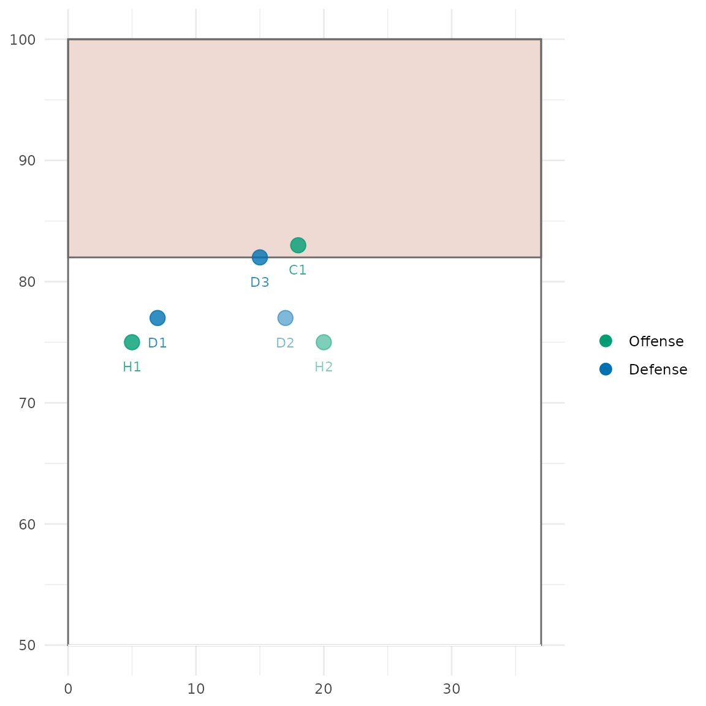

## Pitch arrows

Pitch arrows can be added in a similar way to objects using the
[`pitch_arrow()`](https://swebb1.github.io/ggulti/reference/pitch_arrow.md)
function. However, arrows are typically used to represent player
movements or throws between two players.

### Throws

We can create a list of throws using the
[`throw()`](https://swebb1.github.io/ggulti/reference/throw.md)
function. This function requires an object_list containing objects
(e.g. players) to throw `to` and `from`. The start and end points of a
throw are determined by the involved players positions in a specific
`throwing_frame`.

The `to` argument can also be set to “space” for a throw into empty
space. In this case `space_x` and `space_y` are required to specify the
target location.

You can also specify an `arrow_shape` to show straight or curved throws:

- “straight” = Straight arrow (default)

- “fhrc or bhio” = Right curved arrow

- “bhrc or fhio” = Left curved arrow

``` r
## Add throws between players
throws <- list(
  throw(object_list = player_list, label = "T1", show = F,from = "H1",to = "C1",frame = 1:2, throw_frame = 3, arrow_shape = "bhrc")
)
```

### Player paths

You can also add arrows to represent object movements (e.g. player cuts)
using the
[`object_paths()`](https://swebb1.github.io/ggulti/reference/object_paths.md)
function. This function requires an object_list containing objects
(e.g. players) to plot paths for. The `objects` argument specifies the
object types to plot paths for. By default this is set to “Offense” to
only plot paths for Offense player objects.

``` r
paths <-  object_paths(player_list) ## Add arrows in front of running players
```

Now we can add our throws and paths to create a list of arrows:

``` r
## Create arrow list
arrow_list = list(
  paths,
  throws
)
```

## Adding a disc

We can add discs to our graphics with the
[`pitch_object()`](https://swebb1.github.io/ggulti/reference/pitch_object.md)
function using `object="Disc"` and specifying the coordinates and
frames. Alternatively we can use the
[`disc()`](https://swebb1.github.io/ggulti/reference/disc.md) function
to create a disc that follows a specific throw. This function requires a
`pitch_arrow` object to trace. The `release_frame` argument specifies
the frame where the disc is thrown.

``` r
## Add a disc
disc_list = list(
  disc(throw = throws[[1]],label = "disc",show = F,frame = 1:3,release_frame = 3)
)
```

The disc should be added to our list of pitch objects:

``` r
## Create object list
object_list = c(player_list,disc_list)
```

## Plotting the play

We now have objects and arrows representing players, defenders, cuts,
throws and a disc. We can plot the play using the
[`plot_play()`](https://swebb1.github.io/ggulti/reference/plot_play.md)
function:

``` r
plot_play(pitch = pitch,object_list = object_list,arrow_list = arrow_list,keep_arrows = T,static_frame = 1)
```

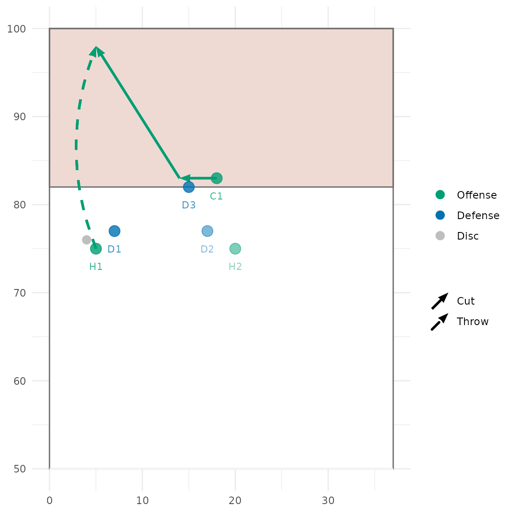

``` r
plot_play(pitch = pitch,object_list = object_list,arrow_list = arrow_list,keep_arrows = T,static_frame = 2)
```

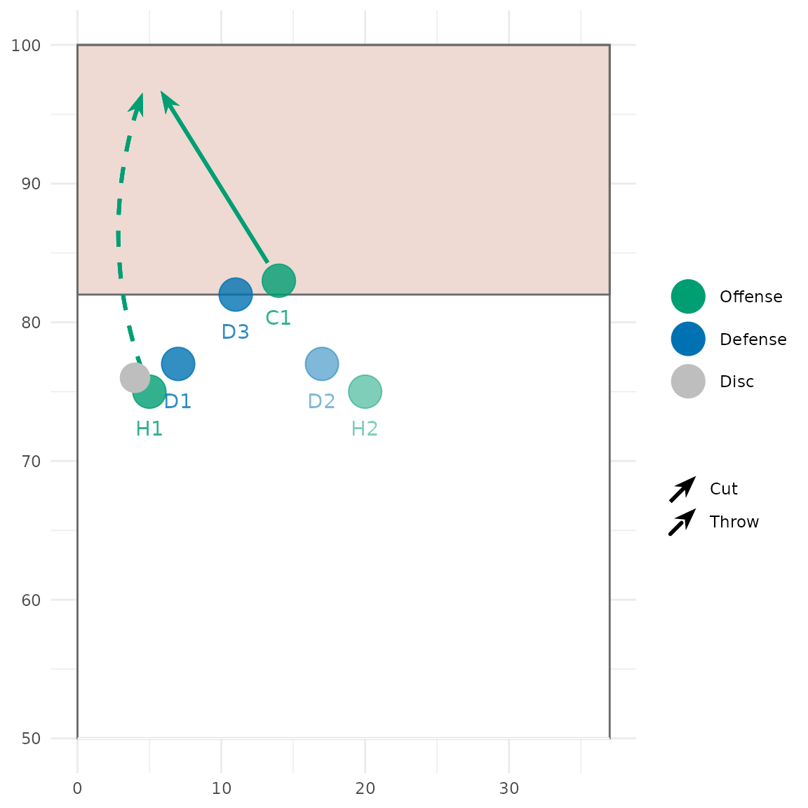

``` r
plot_play(pitch = pitch,object_list = object_list,arrow_list = arrow_list,keep_arrows = T,static_frame = 3)
```

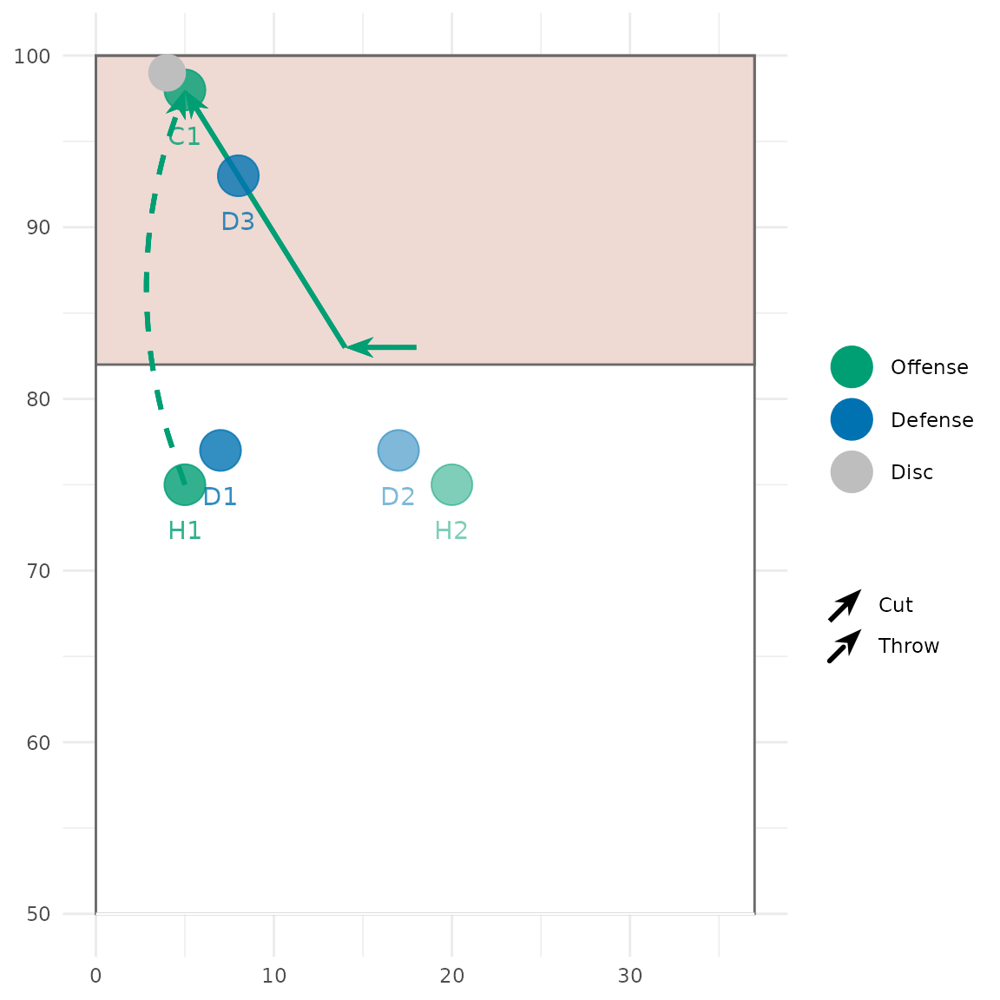

## Animating the play

The big advantage of setting up plays with frames is that we can create
animations. We can animate the play by setting the `animate = T`
argument. Animations use `gganimate` with transition_states. The speed
of the animation can be controlled with the `transition_time` and
`state_time` arguments.

``` r
plot_play(pitch = pitch,object_list = object_list,arrow_list = arrow_list,keep_arrows = T,animate = T,transition_length = 1,state_length = 0.5)
```

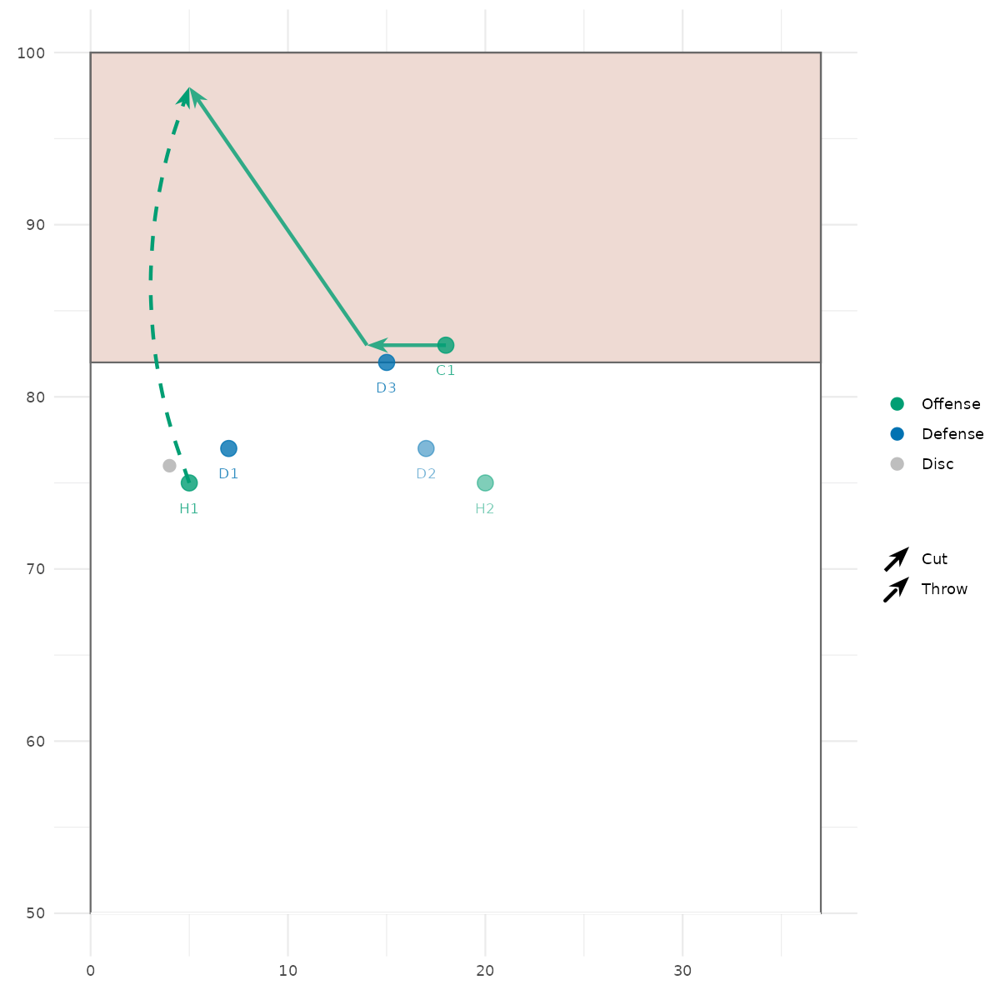

## Further customisation

Because the `plot_play` function returns a ggplot object, we can further
customise the plot using ggplot2 functions. For example, we can add a
title and change the theme:

``` r
library(ggplot2)

plot_play(pitch = pitch,object_list = object_list,arrow_list = arrow_list,keep_arrows = T,static_frame = 1) +
  ggtitle("Back of the zone!") +
  geom_label(aes(x = 18, y = 94, label = "Score!"), size = 7, color = "black") +
  theme_classic()
```

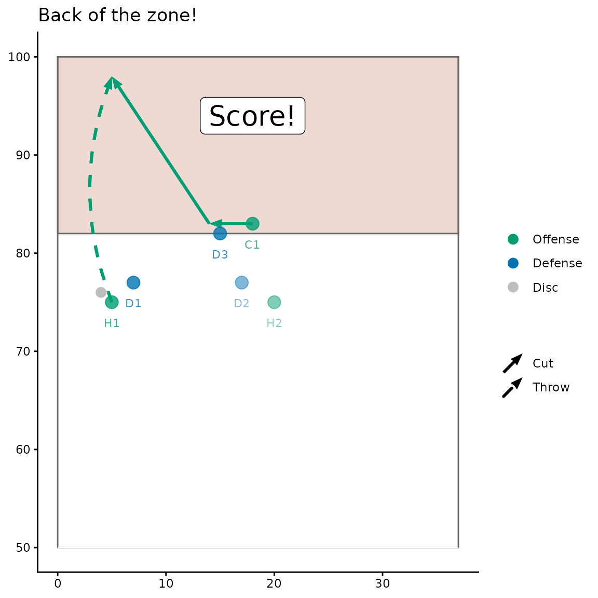

For more control over animations, you can save the
[`plot_play()`](https://swebb1.github.io/ggulti/reference/plot_play.md)
output and run [`gganimate`](https://gganimate.com/index.html) yourself.

``` r
library(gganimate)
library(gifski)

p <- plot_play(pitch = pitch,object_list = object_list,arrow_list = arrow_list,show_all = T)

ap <- p +
transition_states(states = factor(frame, levels = 1:3), transition_length = 0.5, state_length = 0.5, wrap=F) +
  shadow_mark(size = 0, colour = 'grey') +
  enter_fade()

animate(ap, renderer = gifski_renderer())
```

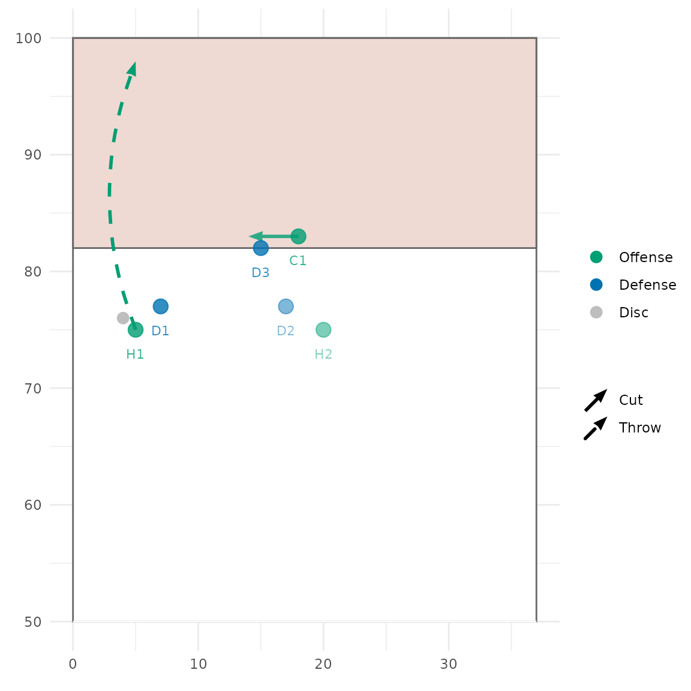
