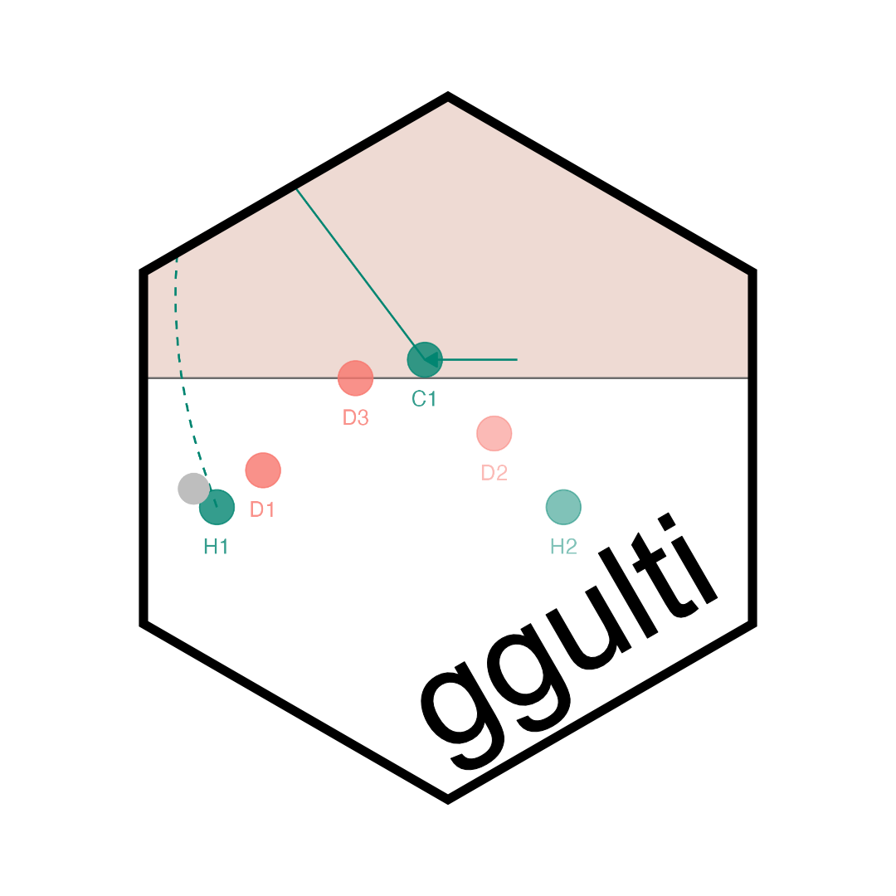

ggulti is an R package for generating Ultimate Frisbee diagrams,
visualisations and animations using ggplot2 graphics.



## Installation

Install ggulti from github with:

``` r
install.packages("devtools")
devtools::install_github("swebb1/ggulti")
```

Load the ggulti package:

``` r
library(ggulti)
```
